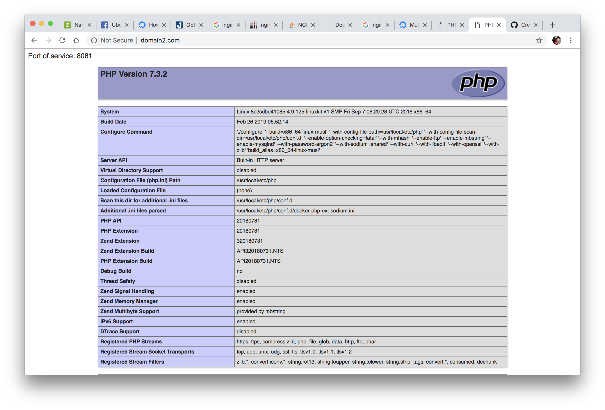

## How to run?
```
docker-compose up
```

## Edit /etc/hosts

```
...
...
127.0.0.1 domain1.com
127.0.0.1 domain2.com
...
...
```

## Browser

```
domain1.com
domain2.com
```



### Nginx
```nginx
server {
   listen      80;
   server_name domain1.com;
   location / {
      proxy_set_header   X-Real-IP $remote_addr;
      proxy_set_header   Host      $http_host;
      proxy_pass         http://server1:8080;
   }
   root /var/www/domain1;
}

server {
   listen       80;
   server_name domain2.com;
   location / {
      proxy_set_header   X-Real-IP $remote_addr;
      proxy_set_header   Host      $http_host;
      proxy_pass         http://server2:8081;
   }
   root /var/www/domain2;
}
```

### docker-compose.yml

```Dockerfile
version: '3'

services:
  nginx:
    build: "./nginx"
    container_name: ng-multidomains
    restart: always
    ports:
      - 80:80
    volumes:
      - "./nginx/conf.d:/etc/nginx/conf.d"
      - "./nginx/log:/var/log/nginx"
    depends_on:
      - server1
      - server2
  server1:
    build: ./php
    container_name: server1
    environment:
      server1: "SERVER 1"
    volumes:
      - "./php/index.php:/var/www/public/index.php"
    command: ["php", "-S", "0.0.0.0:8080", "-t", "/var/www/public"]
  server2:
    build: ./php
    container_name: server2
    environment:
      server1: "SERVER 2"
    volumes:
      - "./php/index.php:/var/www/public/index.php"
    command: ["php", "-S", "0.0.0.0:8081", "-t", "/var/www/public"]
```
